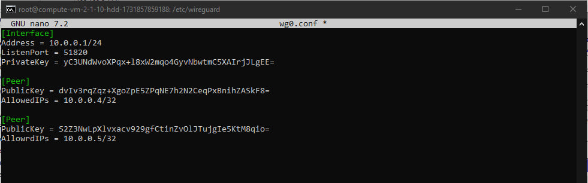
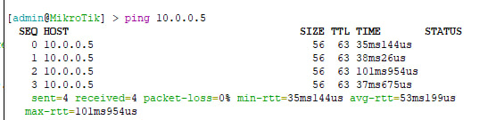
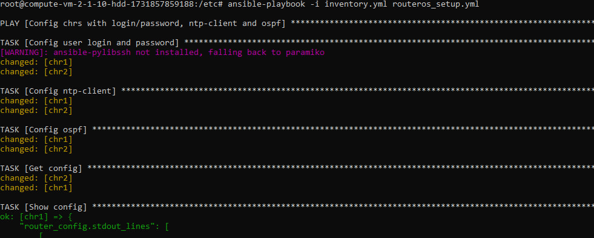
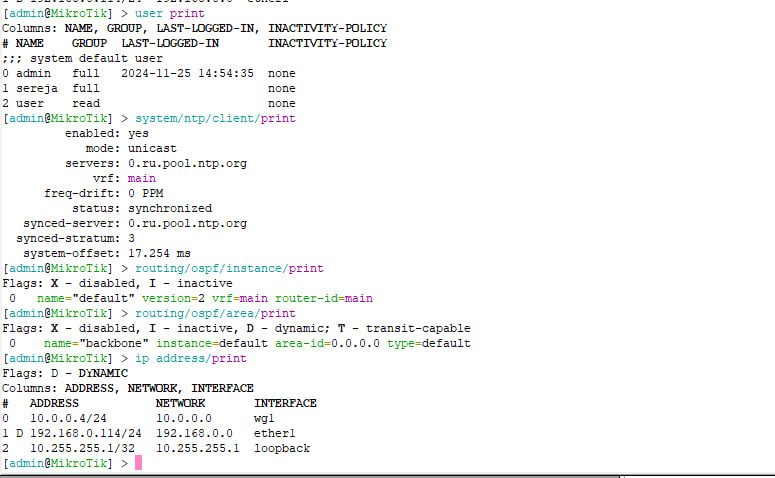
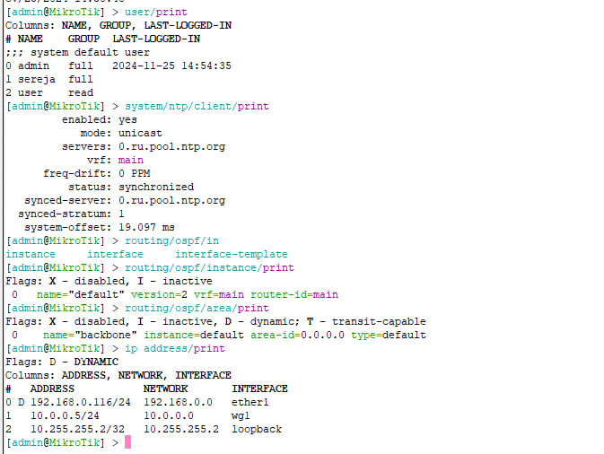

University: [ITMO University](https://itmo.ru/ru/)  
Faculty: [FICT](https://fict.itmo.ru)  
Course: [Network programming](https://github.com/itmo-ict-faculty/network-programming)  
Year: 2024/2025  
Group: K34202  
Author: Islamov Sergey  
Lab: Lab2
Date of create: 25.11.2024  
Date of finished: 

## Лабораторная работа №2 "Развертывание дополнительного CHR, первый сценарий Ansible"

### Описание
В данной лабораторной работе вы на практике ознакомитесь с системой управления конфигурацией Ansible, использующаяся для автоматизации настройки и развертывания программного обеспечения.
### Цель работы
С помощью Ansible настроить несколько сетевых устройств и собрать информацию о них. Правильно собрать файл Inventory.
### Ход работы

Установим второй CHR на своем ПК и организуем второй WireGuard Client на втором CHR и проверим доступ до сервера `10.0.0.1` и между клиентами `10.0.0.4` `10.0.0.5`



Добавим еще один пир в конфигурацию wg0.



Проверим пинг с CHR1 на CHR2. 

P.S. пинги с CHR2 на сервер тоже работают.

Используя Ansible, настроим сразу на 2-х CHR:
- логин/пароль
- NTP Client
- OSPF с указанием Router ID
- Соберем данные по OSPF топологии и полный конфиг устройства

Конфигурация достаточно дефолтная, но рабочая:
```bash
inventory.yml
[routeros]
chr1 ansible_host=10.0.0.4 ansible_user=admin ansible_password=admin ansible_connection=network_cli ansible_network_os=routeros
chr2 ansible_host=10.0.0.5 ansible_user=admin ansible_password=admin ansible_connection=network_cli ansible_network_os=routeros

ansible.cfg
[defaults]
remote_tmp = /tmp
host_key_checking = False
```

Плейбук вышел таким:
```bash
routeros_setup.yml                                                                                                           - name: Config chrs with login/password, ntp-client and ospf
  hosts: all
  gather_facts: no
  vars:
      router_ospf_ip: "{{ '10.255.255.1/32' if ansible_host == '10.0.0.4' else '10.255.255.2/32' }}"
  tasks:
    - name: Add new user
      community.routeros.command:
        commands:
          - /user add name=sereja group=full password=1234
      register: user_config

    - name: Config ntp-client
      community.routeros.command:
        commands:
          - /system ntp client set enabled=yes servers=0.ru.pool.ntp.org
      register: ntp_client_config

    - name: Config ospf
      community.routeros.command:
        commands:
          - /routing ospf instance add name=default
          - /interface bridge add name=loopback
          - /ip address add address={{ router_ospf_ip }} interface=loopback
          - /routing ospf instance set 0 router-id={{ router_ospf_ip }}
          - /routing ospf area add instance=default name=backbone
          - /routing ospf interface-template add area=backbone interfaces=ether1 type=ptp
      register: ospf_config

    - name: Get config
      community.routeros.command:
        commands:
          - /export
      register: router_config

    - name: Show config
      debug:
        var: router_config.stdout_lines
```

Запустим и проверим, что все работает. 
P.S. на этом этапе пришлось пофиксить очень много ошибок, от установки дополнительных библиотек, до проверки подключения через SHH (но я стойкий боец, поэтому справился):



Запуск плейбука

```bash
root@compute-vm-2-1-10-hdd-1731857859188:/etc# ansible-playbook -i inventory.yml routeros_setup.yml

PLAY [Config chrs with login/password, ntp-client and ospf] *********************************************************************************************************************************************************************************

TASK [Config user login and password] *******************************************************************************************************************************************************************************************************
[WARNING]: ansible-pylibssh not installed, falling back to paramiko
changed: [chr1]
changed: [chr2]

TASK [Config ntp-client] ********************************************************************************************************************************************************************************************************************
changed: [chr1]
changed: [chr2]

TASK [Config ospf] **************************************************************************************************************************************************************************************************************************
changed: [chr1]
changed: [chr2]

TASK [Get config] ***************************************************************************************************************************************************************************************************************************
changed: [chr2]
changed: [chr1]

TASK [Show config] **************************************************************************************************************************************************************************************************************************
ok: [chr1] => {
    "router_config.stdout_lines": [
        [
            "# 2024-11-25 14:54:50 by RouterOS 7.16.1",
            "# software id = ",
            "#",
            "/interface bridge",
            "add name=loopback",
            "/interface wireguard",
            "add listen-port=51820 mtu=1420 name=wg1",
            "/routing ospf instance",
            "add disabled=no name=default",
            "/routing ospf area",
            "add disabled=no instance=default name=backbone",
            "/interface wireguard peers",
            "add allowed-address=10.0.0.0/0 endpoint-address=51.250.43.191 endpoint-port=\\",
            "    51820 interface=wg1 name=peer1 persistent-keepalive=25s public-key=\\",
            "    \"EmvNMh6IkY9LRx1nEpllRe3SDjpo1rT1B2oKfIbqcmc=\"",
            "/ip address",
            "add address=10.0.0.4/24 interface=wg1 network=10.0.0.0",
            "add address=10.255.255.1 interface=loopback network=10.255.255.1",
            "/ip dhcp-client",
            "add interface=ether1",
            "/ip firewall filter",
            "add action=accept chain=forward in-interface=wg1 in-interface-list=all \\",
            "    out-interface=wg1",
            "/ip firewall nat",
            "add action=masquerade chain=srcnat",
            "/ip ssh",
            "set always-allow-password-login=yes forwarding-enabled=both",
            "/routing ospf interface-template",
            "add area=backbone disabled=no interfaces=ether1 type=ptp",
            "/system note",
            "set show-at-login=no",
            "/system ntp client",
            "set enabled=yes",
            "/system ntp client servers",
            "add address=0.ru.pool.ntp.org"
        ]
    ]
}
ok: [chr2] => {
    "router_config.stdout_lines": [
        [
            "# 2024-11-25 14:54:50 by RouterOS 7.15.3",
            "# software id = ",
            "#",
            "/interface bridge",
            "add name=loopback",
            "/interface wireguard",
            "add listen-port=51820 mtu=1420 name=wg1",
            "/routing ospf instance",
            "add disabled=no name=default",
            "/routing ospf area",
            "add disabled=no instance=default name=backbone",
            "/interface wireguard peers",
            "add allowed-address=10.0.0.0/0 endpoint-address=51.250.43.191 endpoint-port=\\",
            "    51820 interface=wg1 name=peer2 persistent-keepalive=25s public-key=\\",
            "    \"EmvNMh6IkY9LRx1nEpllRe3SDjpo1rT1B2oKfIbqcmc=\"",
            "/ip address",
            "add address=10.0.0.5/24 interface=wg1 network=10.0.0.0",
            "add address=10.255.255.2 interface=loopback network=10.255.255.2",
            "/ip dhcp-client",
            "add interface=ether1",
            "/ip firewall nat",
            "add action=masquerade chain=srcnat",
            "/routing ospf interface-template",
            "add area=backbone disabled=no interfaces=ether1 type=ptp",
            "/system note",
            "set show-at-login=no",
            "/system ntp client",
            "set enabled=yes",
            "/system ntp client servers",
            "add address=0.ru.pool.ntp.org"
        ]
    ]
}

PLAY RECAP **********************************************************************************************************************************************************************************************************************************
chr1                       : ok=5    changed=4    unreachable=0    failed=0    skipped=0    rescued=0    ignored=0
chr2                       : ok=5    changed=4    unreachable=0    failed=0    skipped=0    rescued=0    ignored=0
```
Сверим, что полученные конфигурации корректны:



### Вывод
В ходе данной работы с помщью Ansible были настроены несколько сетевых устройств, а также успешно собрана информация о них.
