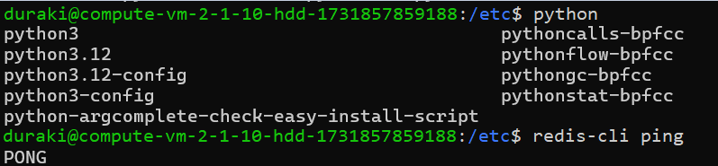

University: [ITMO University](https://itmo.ru/ru/)  
Faculty: [FICT](https://fict.itmo.ru)  
Course: [Network programming](https://github.com/itmo-ict-faculty/network-programming)  
Year: 2024/2025  
Group: K34202  
Author: Islamov Sergey  
Lab: Lab3
Date of create: 21.11.2024  
Date of finished: 

## Лабораторная работа №3 "Развертывание Netbox, сеть связи как источник правды в системе технического учета Netbox"

### Описание
В данной лабораторной работе вы ознакомитесь с интеграцией Ansible и Netbox и изучите методы сбора информации с помощью данной интеграции.

### Цель работы
С помощью Ansible и Netbox собрать всю возможную информацию об устройствах и сохранить их в отдельном файле.

### Ход работы
Установка Netbox, начнем с различных компонент.

>Установка postgres
```bash
duraki@compute-vm-2-1-10-hdd-1731857859188:~$ sudo -u postgres psql
psql (16.4 (Ubuntu 16.4-0ubuntu0.24.04.2))
Type "help" for help.

postgres=# CREATE DATABASE netbox;
CREATE DATABASE
postgres=# CREATE USER netbox WITH PASSWORD '123';
CREATE ROLE
postgres=# GRANT ALL PRIVILEGES ON DATABASE netbox TO netbox;
GRANT
postgres=# \q
```


>Модули python и redis.



>Приступим к миграциям


>Перейдем в нетбокс и залогинимся.
```bash
(venv) duraki@compute-vm-2-1-10-hdd-1731857859188:/opt/netbox/netbox$ python3 manage.py runserver 0.0.0.0:8000 --insecure
Performing system checks...

System check identified no issues (0 silenced).
November 21, 2024 - 14:13:22
Django version 5.0.9, using settings 'netbox.settings'
Starting development server at http://0.0.0.0:8000/
Quit the server with CONTROL-C.
```

>Добавим наши устройства (Два CHR для дальнейшей работы) 


C помощью роли для экспорта данных, используя Ansible сохраним все данные из Netbox в отдельный файл и приступим к написанию плейбука, который сможет настроить 2 CHR, изменить имена устройств и добавить IP-адрес.

>Плейбук для конфигурации CHR
```bash
- name: Configure CHR
  hosts: chr_routers
  gather_facts: no
  vars:
    netbox_url: "http://158.160.133.135:8000/api/"
    netbox_api_token: "ee977aaf25643c2d24bfb491d7b1a2851447bc02"

  tasks:
    - name: Fetch some data
      uri:
        url: "{{ netbox_url }}/api/dcim/devices/?name={{ ansible_host }}"
        method: GET
        headers:
          Authorization: "Token {{ netbox_api_token }}"
        return_content: yes
      register: netbox_device_data

    - name: Check device eligibility
      fail:
        msg: "Device not found in NetBox for {{ ansible_host }}"
      when: netbox_device_data.json.results | length == 0

    - name: Setting Ip-address 
      set_fact:
        netbox_ip_address: "{{ netbox_device_data.json.results[0].primary_ip.address }}"
        netbox_interface: "{{ netbox_device_data.json.results[0].primary_ip.interface.name }}"

    - name: Setting hostname
      community.routeros.command:
        commands:
          - /system identity set name={{ ansible_host }}
      register: hostname_result

    - name: Show hostname
      debug:
        var: hostname_result

    - name: Adding IP
      community.routeros.command:
        commands:
          - /ip address add address={{ netbox_ip_address }} interface={{ netbox_interface }}
      register: ip_address_result

    - name: Show IP
      debug:
        var: ip_address_result
```
>Проверим отработку плейбука.


>Теперь с помощью еще одного плейбука внесем серийный номер устройства в Netbox.
```bash
- name: Collect serial number
  hosts: chr_routers
  gather_facts: no
  vars:
    netbox_url: "http://158.160.133.135:8000/api/"
    netbox_api_token: "ee977aaf25643c2d24bfb491d7b1a2851447bc02"

  tasks:
    - name: Gather serial number
      community.routeros.command:
        commands:
          - /system license print
      register: serial_output

    - name: Verify serial number
      fail:
        msg: "Could not find serial number"
      when: serial_number is not defined or serial_number == ""

    - name: Fetch device ID
      uri:
        url: "{{ netbox_url }}/api/dcim/devices/?name={{ inventory_hostname }}"
        method: GET
        headers:
          Authorization: "Token {{ netbox_api_token }}"
        validate_certs: no
        return_content: yes
      register: netbox_device_data
      failed_when: "'results' not in netbox_device_data.json or netbox_device_data.json.results | length == 0"

    - name: Extract device ID
      set_fact:
        device_id: "{{ netbox_device_data.json.results[0].id }}"

    - name: Update serial number
      uri:
        url: "{{ netbox_url }}/api/dcim/devices/{{ device_id }}/"
        method: PATCH
        headers:
          Authorization: "Token {{ netbox_api_token }}"
          Content-Type: "application/json"
        body: "{{ {'serial': serial_number} | to_json }}"
        status_code: 200
        validate_certs: no
      register: update_response

    - name: Check if serial number update was successful
      debug:
        msg: "Serial number for {{ inventory_hostname }} updated to {{ serial_number }} in NetBox"
      when: update_response.status == 200
```
> Подтвердим успех проделанных операций, зайдя в устройство в нетбоксе


### Вывод

В ходе данной работы был применен Netbox, с использованием Ansible, для сбора информации о наших CHR1 и CHR2.


